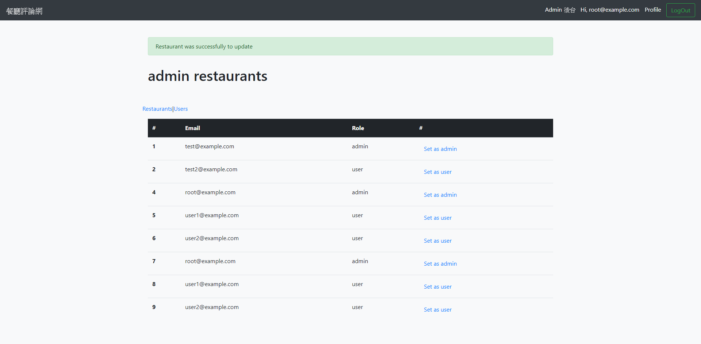

# Restaurant Forum
**[Heroku demo](https://restaurant-forum-mina.herokuapp.com/)**
This is a Restaurant Forum with Sequelize demo which built up from [Alphacamp](https://tw.alphacamp.co/) semester 4 assignment.



## Feature
1. Admin and user different route.
2. CRUD restaurants.
3. Show all users data and update role.

## Installing

### 1. Git bash

#### git clone

`git clone` to clone the project.

```markdown
git clone https://github.com/mpragnarok/restaurant-forum
```
### 2. MySQL Server

Install [MySQL Workbench](https://dev.mysql.com/downloads/workbench/) and connect to local server

Create a new database:

```mysql
drop database if exists forum;
create database forum;
```

Use database and show the data in the table:

```mysql
use forum;
select * from restaurants;
select * from users;
```

You can list the data in table with `select * from table-name` after you create the user and todo in the server.

### 3. Environment variable

Go to https://api.imgur.com/oauth2/addclient to create your own **Client ID**

Create `.env` in the root folder

```js
// .env
IMGUR_CLIENT_ID=<Your CLIENT ID>
```

### 4. Command line

#### npm install

Install all the packages in the project.

### 5. configure sequelize

#### config/config.json

```js
{
  "development": {
    "username": "root",
    "password": <YOUR_MYSQL_WORKBENCH_PASSWORD>,
    "database": "todo_sequelize",
    "host": "127.0.0.1",
    "dialect": "mysql"
  },
  "test": {
    "username": "root",
    "password": null,
    "database": "database_test",
    "host": "127.0.0.1",
    "dialect": "mysql"
  },
  "production": {
    "username": "root",
    "password": null,
    "database": "database_production",
    "host": "127.0.0.1",
    "dialect": "mysql"
  }
}
```

#### run the migration

In the powershell, run the migration with follow script:

```powershell
npx sequelize db:migrate
```
#### run the seeder

In the powershell, run the migration with follow script:

```powershell
npx sequelize db:seed:all
```
**Default accounts / password / role**

1. user1@example.com / 12345678 / user
2. user2@example.com / 12345678 / user
3. root@example.com / 12345678 / admin

### 7. Command line

#### npm run dev

Start the server with **nodemon** command.

2. npm run start

Start the server with node command.

#### CTRL + C twice

Stop running server.

### Browser

Head to [http://localhost:3000](http://localhost:3000) to experience the demo.

## Description

​	The page has a dynamic index to show up the content of web page which contains front-end and back-end techniques. Front-end part is written in **JavaScript**, **CSS** and **HTML** with **Bootstrap**, back-end part is written in **Node.js** and **Express.js**, server side uses  **MySQL** with **Sequelize**.  

​	The dynamic webpage is made up by **handlebars**. In the home page, it lists all todos with the order in descending update time.

## Contribute
1. [Mina Huang]( https://github.com/mpragnarok )


   
